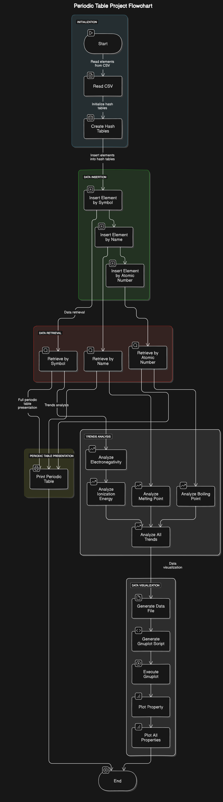

# 🧪 Periodic Table Implementation in C

Welcome to the Periodic Elements Explorer - a powerful C-based tool for chemistry enthusiasts and students alike!

## Table of Contents
1. [Overview](#overview)
2. [Features](#-features)
3. [How It Works](#how-it-works)
4. [File Structure](#file-structure)
5. [Getting Started](#getting-started)
   - [For Unix-like systems (Linux, macOS)](#for-unix-like-systems-linux-macos)
   - [For Windows](#for-windows)
6. [Usage](#usage)
7. [Performance](#performance)
8. [Future Scope](#future-scope)

## Overview
This project is a comprehensive C implementation of a periodic table of elements. It provides an interactive interface for exploring element data, analyzing trends, and visualizing chemical properties. The application uses efficient data structures and algorithms to ensure fast lookups and responsive analysis.

## 🌟 Features
- **Fast Data Retrieval**: Utilizes a hash table for quick element lookups.
- **Multiple Search Options**: Search elements by name, symbol, or atomic number.
- **Full Periodic Table Display**: View the entire periodic table.
- **Trend Analysis**: Analyze trends for various properties including:
  - Electronegativity
  - Melting point
  - Boiling point
  - Ionization energy
  - Electron affinity
  - Atomic radius
- **Data Visualization**: Plot trends with options to display in a pop-up window or save as PNG.
- **Interactive Menu**: User-friendly command-line interface.

## How It Works


## File Structure
```
project_root/
│
├── .vscode/
│   ├── launch.json
│   ├── settings.json
│   └── tasks.json
│
├── bin/
│   ├── data.csv
│   └── test_data.csv
│
├── include/
│   ├── csv_reader.h
│   ├── hashtable.h
│   ├── periodic_table.h
│   ├── plotFunctions.h
│   └── trends.h
│
├── src/
│   ├── csvReader.c
│   ├── hashtable.c
│   ├── main.c
│   ├── periodictable.c
│   ├── plotFunctions.c
│   └── trends.c
│
├── tests/
│   └── test_main.c
│
└── Makefile
```

### Directory and File Descriptions:
- `.vscode/`: Contains VS Code configuration files for the project.
- `bin/`: Stores binary and data files.
  - `data.csv`: Main data file for the periodic table.
  - `test_data.csv`: Test data for unit testing.
- `include/`: Contains header files for the project.
- `src/`: Contains the source code files.
- `tests/`: Contains unit tests for the project.
- `Makefile`: Automates the build process.

## Getting Started

### For Unix-like systems (Linux, macOS)
1. Ensure you have a C compiler installed (e.g., GCC).
2. Install Gnuplot:
   - For Ubuntu/Debian: `sudo apt-get install gnuplot`
   - For macOS (using Homebrew): `brew install gnuplot`
3. Clone the repository to your local machine.
4. Navigate to the project directory.
5. Build the project using the Makefile:
   ```
   make
   ```
6. Run the compiled program:
   ```
   ./bin/periodic_table
   ```

### For Windows
1. Install a C compiler:
   - Option 1: Install MinGW-w64 from [MinGW-w64 website](https://mingw-w64.org/doku.php/download)
   - Option 2: Install Visual Studio Community Edition with "Desktop development with C++" workload
2. Install Gnuplot:
   - Download and install from the [Gnuplot website](http://www.gnuplot.info/download.html)
3. Clone the repository to your local machine.
4. Navigate to the project directory in Command Prompt or PowerShell.
5. Compile the project:
   - If using MinGW:
     ```
     gcc src\*.c -I include -o bin\periodic_table.exe
     ```
   - If using Visual Studio Developer Command Prompt:
     ```
     cl /I include src\*.c /Fe: bin\periodic_table.exe
     ```
6. Run the compiled program:
   ```
   bin\periodic_table.exe
   ```

Note: You may need to add the Gnuplot or MinGW or Visual Studio compiler to your system's PATH for the commands to work in any directory.


## Usage
1. Upon running the program, you'll be presented with a menu of options.
2. Choose an option by entering the corresponding number:
   - Print entire periodic table
   - Search by full symbol
   - Search by full name
   - Search by atomic number
   - Analyze specific trend
   - Analyze all trends
   - Plot specific trend
   - Quit
3. Follow the prompts to search for elements, analyze trends, or visualize data.
4. To exit the program, choose the "Quit" option from the menu.

## Performance
- **Element Lookups**: O(1) average time complexity due to hash table implementation.
- **Trend Analysis**: O(n) time complexity for analyzing trends, where n is the number of elements in the specified range.
- **Data Loading**: O(m) time complexity, where m is the total number of elements in the CSV file.

The use of a hash table ensures that individual element lookups remain fast even as the dataset grows, making this implementation scalable and efficient for various applications in chemistry education and research.

## Future Scope
1. **GUI Implementation**: Develop a graphical user interface for more intuitive interaction with the periodic table and data visualization.
2. **Extended Element Data**: Include more detailed information for each element, such as isotopes, discovery date, and common applications.
3. **3D Visualization**: Implement 3D models of atomic structures and electron configurations.
4. **Compound Predictor**: Add functionality to predict possible compounds based on selected elements and their properties.
5. **Integration with External Databases**: Allow users to pull up-to-date element data from reputable online chemistry databases.


